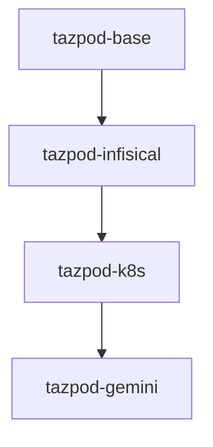

# Docker Layers & Images 🧅

TazPod uses a strict **Vertical Layering** strategy. Instead of one giant Dockerfile, we build images in a chain. This reduces build time and allows users to choose the "weight" of their environment.

## 1. The Hierarchy



---

## 2. Layer Details

### 🟢 `tazpod-base` (The Foundation)
*   **OS**: Ubuntu 24.04 LTS (Noble Numbat).
*   **User**: `tazpod` (UID 1000) with passwordless sudo.
*   **Core Tools**: `curl`, `wget`, `git`, `unzip`, `build-essential`.
*   **Shell Experience**:
    *   **Neovim**: Pre-configured with LazyVim.
    *   **Tmux**: Terminal multiplexer.
    *   **Starship**: Cross-shell prompt.
    *   **Zoxide**: Smarter `cd`.
    *   **Eza**: Modern `ls`.
    *   **Bat**: Modern `cat`.

### 🟡 `tazpod-infisical` (The Security Layer)
*   **Inherits from**: `tazpod-base`.
*   **Adds**: The `infisical` CLI via official apt repository.
*   **Purpose**: Minimal secure environment for secrets management without heavy DevOps tools.

### 🔵 `tazpod-k8s` (The DevOps Layer)
*   **Inherits from**: `tazpod-infisical`.
*   **Adds**:
    *   `kubectl`: Kubernetes CLI.
    *   `helm`: Package manager.
    *   `k9s`: Terminal UI for K8s.
    *   `talosctl`: Talos Linux OS manager.
    *   `stern`: Multi-pod log tailing.
*   **Purpose**: The standard daily driver for Cluster Ops.

### 🟣 `tazpod-gemini` (The AI Layer)
*   **Inherits from**: `tazpod-k8s`.
*   **Adds**:
    *   `Node.js` (LTS via NVM).
    *   `@google/gemini-cli`: Google's AI assistant in the terminal.
*   **Purpose**: Coding assistant and complex troubleshooting with AI support.

---

## 3. Extending TazPod

You can create your own layer on top of any of these images using the `.tazpod/Dockerfile` generated by `init`.

```dockerfile
# Custom Project Layer
FROM tazzo/tazlab.net:tazpod-k8s

USER root
RUN apt-get install -y python3-pip
USER tazpod
```

This ensures you benefit from the core security features while adding project-specific tools.
