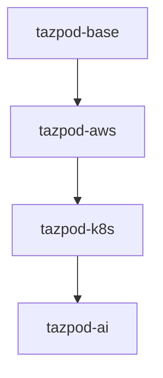

# Docker Layers & Images

TazPod follows a **Modular Vertical** strategy. We provide highly optimized base layers that you can combine or extend to fit your specific workflow.

## 1. Image Hierarchy

TazPod images are built in a chain to ensure consistency and minimize build time.


```mermaid
graph TD
    A[tazpod-base] --> B[tazpod-aws]
    B --> C[tazpod-k8s]
    C --> D[tazpod-ai]
```

---

## 2. Layer Details (v0.3.x)

### `tazpod-base` (The IDE Foundation)
*   **OS**: Ubuntu 24.04 LTS (Noble Numbat).
*   **Editor**: **Neovim** (Stable) with LazyVim.
*   **Shell**: **Bash** with **Starship** prompt, **Zoxide**, **FZF**, **Eza**, and **Bat**.
*   **Multiplexer**: **Tmux** (Pre-configured with TPM).
*   **Runtime**: **Node.js** (LTS via NVM) and **Python 3**.

### `tazpod-aws` (Cloud Credentials)
*   **Adds**: **AWS CLI v2**, S3 tools, and the AWS credential chain wired for SSO (`aws sso login`).
*   **Purpose**: Secure environments that need AWS SSO authentication and S3-backed vault operations.

### `tazpod-k8s` (Cloud Native)
*   **Adds**:
    *   `kubectl`, `helm`, `k9s`.
    *   `talosctl` (Talos OS management).
    *   `stern` (Log tailing).
    *   `terraform`.
*   **Purpose**: The standard daily driver for DevOps engineers and SREs.

### `tazpod-ai` (AI Enhanced)
*   **Adds**: `pi` (pi-coding-agent), `omp` (oh-my-pi), and mnemosyne dependencies.
*   **Purpose**: An AI-augmented terminal for complex troubleshooting and coding assistance.

---

## 3. Extending Your Env

The `init` command generates a `.tazpod/Dockerfile` (Template) that allows you to add project-specific dependencies.

```dockerfile
# Custom Project Layer
FROM tazzo/tazpod-ai

USER root
RUN apt-get update && apt-get install -y postgresql-client
USER tazpod
```

---

*Next: Learn about the Kubernetes integration roadmap in [07-KUBERNETES-POD.md](./07-KUBERNETES-POD.md)
