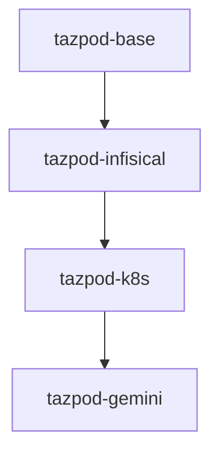

# Docker Layers & Images 🧅

TazPod follows a **Modular Vertical** strategy. We provide highly optimized base layers that you can combine or extend to fit your specific workflow.

## 1. Image Hierarchy

TazPod images are built in a chain to ensure consistency and minimize build time.


```mermaid
graph TD
    A[tazpod-base] --> B[tazpod-infisical]
    B --> C[tazpod-k8s]
    C --> D[tazpod-gemini]
```

---

## 2. Layer Details (Stable v0.2.0)

### 🟢 `tazpod-base` (The IDE Foundation)
*   **OS**: Ubuntu 24.04 LTS (Noble Numbat).
*   **Editor**: **Neovim** (Stable) with LazyVim.
*   **Shell**: **Bash** with **Starship** prompt, **Zoxide**, **FZF**, **Eza**, and **Bat**.
*   **Multiplexer**: **Tmux** (Pre-configured with TPM).
*   **Runtime**: **Node.js** (LTS via NVM) and **Python 3**.

### 🟡 `tazpod-infisical` (Secrets Ready)
*   **Adds**: The **Infisical CLI** and the TazPod secret injection logic.
*   **Purpose**: Secure coding environments that require dynamic secret fetching but don't need heavy DevOps tools.

### 🔵 `tazpod-k8s` (Cloud Native)
*   **Adds**:
    *   `kubectl`, `helm`, `k9s`.
    *   `talosctl` (Talos OS management).
    *   `stern` (Log tailing).
    *   `terraform`.
*   **Purpose**: The standard daily driver for DevOps engineers and SREs.

### 🟣 `tazpod-gemini` (AI Enhanced)
*   **Adds**: `@google/gemini-cli`.
*   **Purpose**: An AI-augmented terminal for complex troubleshooting and coding assistance.

---

## 3. Extending Your Env

The `init` command generates a `.tazpod/Dockerfile` (Template) that allows you to add project-specific dependencies.

```dockerfile
# Custom Project Layer
FROM tazzo/tazlab.net:tazpod-gemini

USER root
RUN apt-get update && apt-get install -y postgresql-client
USER tazpod
```

---

## 4. Local Build Engine

TazPod includes a `kaniko` executor bridge, allowing you to build and push container images **directly from within the Pod** without needing Docker-in-Docker or host-level access.

*   See `Taskfile.yml` for local build automation.

---
*Next: Learn about the Kubernetes integration roadmap in [07-KUBERNETES-POD.md](./07-KUBERNETES-POD.md)*